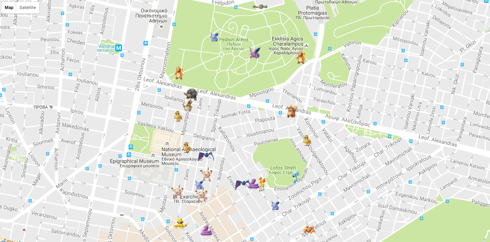

# Pokemongo-Live-GeoJSON

Just started. Do NOT expect big yet but at least it works... :laughing:

### Description
A bot scans a specific area and retuns a GeoJSON file which is then used to show pokemons on a Google map.

### Requirements
NodeJS installation https://nodejs.org/en/

### To use - No npm module yet

1. Download project and cd into folder</br>
2. npm install pokemon-go-node-api replace openurl</br>
3. Edit config.js file according to your needs</br>
4. Open cmd
4.1 Execute ```node geoJSONcreator.js```, the map will open</br>
4.2 Or for example: ```node geoJSONcreator.js Times square new york```
5. Wait until pokemons appear :punch:</br>
```
//Set environment variables or replace placeholder text
username = process.env.PGO_USERNAME || 'USER';
password = process.env.PGO_PASSWORD || 'PASSWD';
distanceTo=0.01;
//Southwest corner of area to scan
sw_coords = {
            lat: 37.984998,  //EXAMPLE
            lon: 23.733532   //EXAMPLE
        };
```

### Screenshot

<p align="center">
  
</p>
